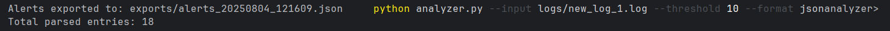
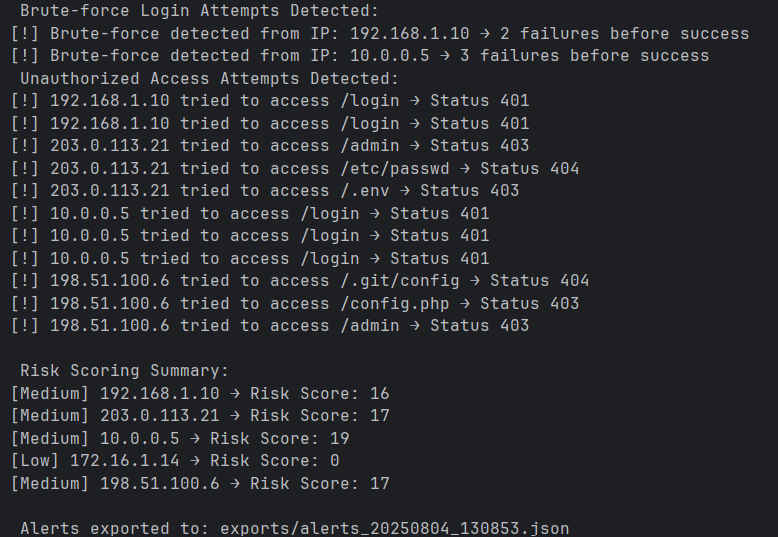
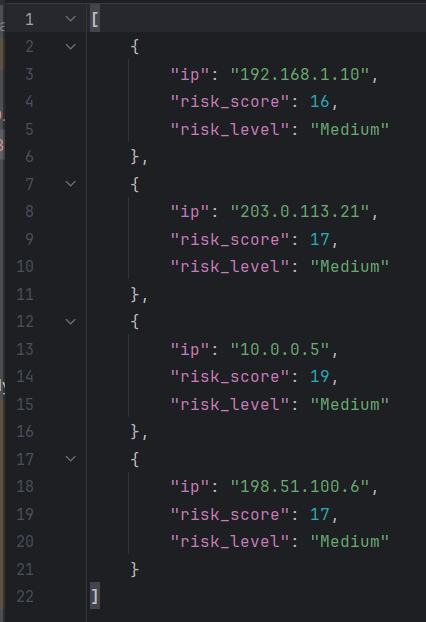
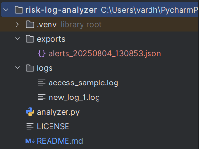

# Risk Log Analyzer – Project Report

---

## Overview
**Risk Log Analyzer** is a Python-based CLI tool designed to parse access logs, identify malicious behavior (like brute-force attacks, unauthorized access), and generate structured alerts based on risk scores.

---

## Objectives
- Detect brute-force login attempts
- Identify access to sensitive endpoints
- Assign risk scores per IP/session
- Export alerts in JSON/CSV
- Use CLI arguments for custom runs

---

## Log Format Example
```log
192.168.1.10 - - [04/Aug/2025:10:05:01 +0530] "POST /login HTTP/1.1" 401 - "Mozilla/5.0"
```

---

## Architecture
```text
1. Log Parser       → Extract fields via regex
2. Session Grouper  → Group logs by IP
3. Threat Analyzer  → Identify brute-force & unauthorized access
4. Scoring Engine   → Assign risk scores
5. Exporter         → Output JSON/CSV alerts
```

### Scoring Logic
| Behavior                                | Score |
|-----------------------------------------|--------|
| Failed login (401)                      | +3     |
| Brute-force (2+ 401s → 200)             | +10    |
| Access to /admin, /.env, /etc          | +7     |
| 403/401 on restricted endpoints         | +5     |

### Risk Levels
| Score Range | Level   |
|-------------|---------|
| 0–10        | Low     |
| 11–20       | Medium  |
| 21+         | High    |

---

## CLI Usage
```bash
python analyzer.py --input logs/new_log_1.log --threshold 10 --format json
```

### Arguments:
- `--input`: Log file path
- `--threshold`: Min risk score to include
- `--format`: `json` or `csv`

---

## Example Results

### Input: `logs/new_log_1.log`
```log
192.168.1.10 - - [04/Aug/2025:10:05:01 +0530] "POST /login HTTP/1.1" 401 - "Mozilla/5.0"
192.168.1.10 - - [04/Aug/2025:10:05:04 +0530] "POST /login HTTP/1.1" 401 - "Mozilla/5.0"
192.168.1.10 - - [04/Aug/2025:10:05:08 +0530] "POST /login HTTP/1.1" 200 - "Mozilla/5.0"

203.0.113.21 - - [04/Aug/2025:10:06:00 +0530] "GET /admin HTTP/1.1" 403 - "curl/7.68.0"
203.0.113.21 - - [04/Aug/2025:10:06:01 +0530] "GET /etc/passwd HTTP/1.1" 404 - "curl/7.68.0"
203.0.113.21 - - [04/Aug/2025:10:06:02 +0530] "GET /.env HTTP/1.1" 403 - "curl/7.68.0"

10.0.0.5 - - [04/Aug/2025:10:07:10 +0530] "GET /login HTTP/1.1" 200 - "Mozilla/5.0"
10.0.0.5 - - [04/Aug/2025:10:07:12 +0530] "POST /login HTTP/1.1" 401 - "Mozilla/5.0"
10.0.0.5 - - [04/Aug/2025:10:07:15 +0530] "POST /login HTTP/1.1" 401 - "Mozilla/5.0"
10.0.0.5 - - [04/Aug/2025:10:07:20 +0530] "POST /login HTTP/1.1" 401 - "Mozilla/5.0"
10.0.0.5 - - [04/Aug/2025:10:07:22 +0530] "POST /login HTTP/1.1" 200 - "Mozilla/5.0"

172.16.1.14 - - [04/Aug/2025:10:08:05 +0530] "GET /dashboard HTTP/1.1" 200 - "Mozilla/5.0"
172.16.1.14 - - [04/Aug/2025:10:08:10 +0530] "POST /note/save HTTP/1.1" 200 - "Mozilla/5.0"
172.16.1.14 - - [04/Aug/2025:10:08:30 +0530] "POST /logout HTTP/1.1" 200 - "Mozilla/5.0"

198.51.100.6 - - [04/Aug/2025:10:09:00 +0530] "GET /robots.txt HTTP/1.1" 200 - "Mozilla/5.0"
198.51.100.6 - - [04/Aug/2025:10:09:01 +0530] "GET /.git/config HTTP/1.1" 404 - "Mozilla/5.0"
198.51.100.6 - - [04/Aug/2025:10:09:03 +0530] "GET /config.php HTTP/1.1" 403 - "Mozilla/5.0"
198.51.100.6 - - [04/Aug/2025:10:09:04 +0530] "GET /admin HTTP/1.1" 403 - "Mozilla/5.0"
```

### Output:
```json
[
    {
        "ip": "192.168.1.10",
        "risk_score": 16,
        "risk_level": "Medium"
    },
    {
        "ip": "203.0.113.21",
        "risk_score": 17,
        "risk_level": "Medium"
    },
    {
        "ip": "10.0.0.5",
        "risk_score": 19,
        "risk_level": "Medium"
    },
    {
        "ip": "198.51.100.6",
        "risk_score": 17,
        "risk_level": "Medium"
    }
]
```
---

## Use Cases
- Simulate real-world log analysis
- Demonstrate CLI security tool design
- Practice SOC-style risk classification
- Resume-ready for security internships

---

## Future Upgrades
- Docker support
- CLI colorization (colorama)
- Automated log generation
- GitHub Actions testing + release

---
## Screenshots
### CLI Execution in PyCharm



-This screenshot shows the execution of `analyzer.py` with sample log input. It calculates risk scores and exports alerts in structured format.

---

### JSON Alert Output



-Exported alert data showing IPs with calculated risk scores and their classification as Low, Medium, or High risk.

---

### JSON Export



-Only entries above the threshold are included in the final JSON

---

### Project Folder Structure



-This image displays the overall structure of the project inside PyCharm, including source files, logs, and outputs.
